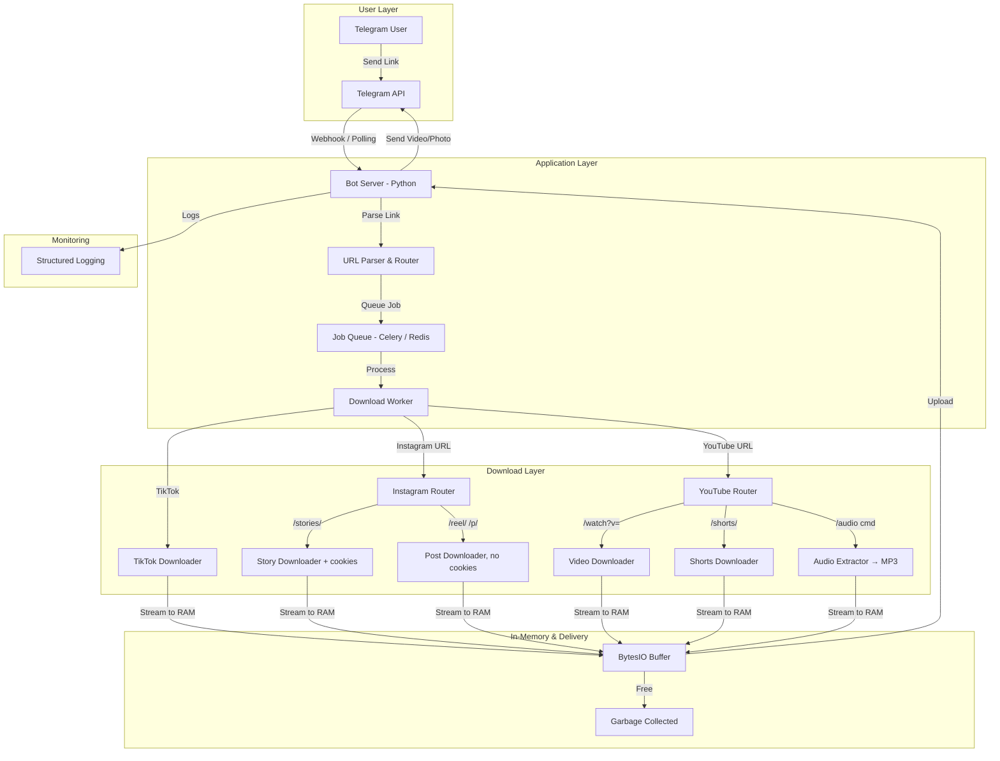
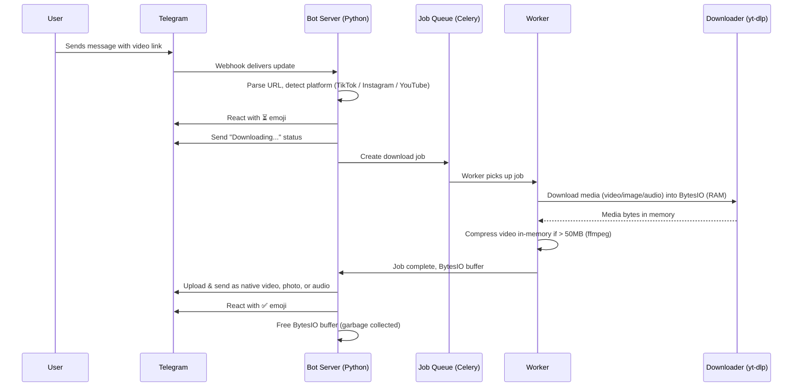
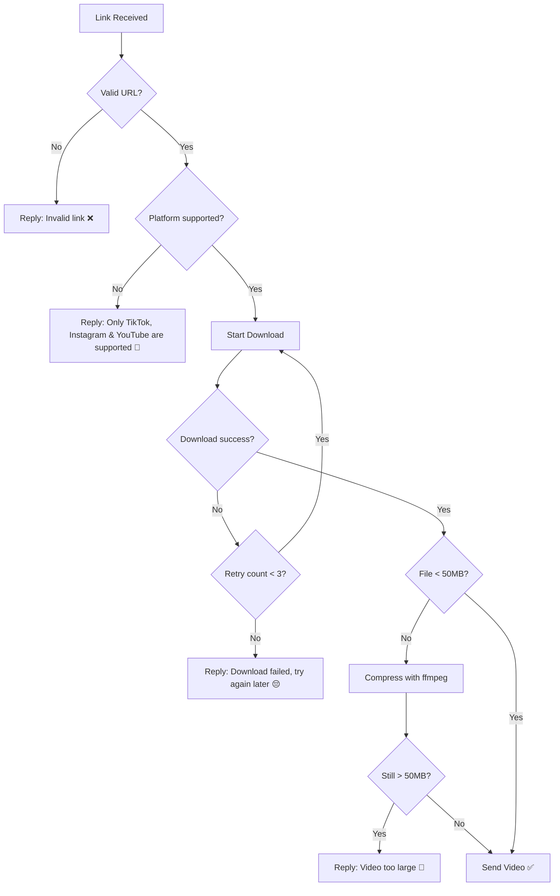
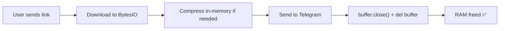

# 🤖 Telegram Video Downloader Bot — System Design

> **Author:** Senior Engineering Team  
> **Date:** 2026-03-07  
> **Status:** Draft / Awaiting Review  
> **Tech Stack:** Python  
> **Supported Platforms:** TikTok, Instagram, YouTube

---

## 1. Overview

A Telegram bot that receives video and image links from **TikTok**, **Instagram**, and **YouTube**, downloads the media, and sends it back to the user **as native Telegram media** (video plays inline, images display inline) — as if a real person shared it. The bot also supports emoji reactions and provides a smooth, human-like messaging experience.

---

## 2. Functional Requirements

### ✅ Core Features

| #   | Feature               | Description                                                                               |
| --- | --------------------- | ----------------------------------------------------------------------------------------- |
| 1   | **Link Detection**    | Bot detects video and image links from TikTok, Instagram, and YouTube in any message      |
| 2   | **Media Download**    | Downloads the video or image from the detected link                                       |
| 3   | **Native Media Send** | Sends video as Telegram video (plays inline) or image as Telegram photo (displays inline) |
| 4   | **Emoji Reactions**   | Bot reacts to messages with emoji (👍, ❤️, 🔥, etc.) to feel human-like                   |
| 5   | **TikTok Support**    | Download TikTok videos (no watermark) and images                                          |
| 6   | **Instagram Support** | Download Instagram Reels / Posts (no cookies) and Stories (requires cookies)              |
| 7   | **YouTube Support**   | Download YouTube videos and Shorts in best quality; extract MP3 audio via `/audio`        |

### 🚀 Additional Features

| #   | Feature                      | Description                                                          |
| --- | ---------------------------- | -------------------------------------------------------------------- |
| 8   | **Auto-Caption**             | Optionally include the original post caption as a message            |
| 9   | **Progress Indicator**       | Show "⏳ Downloading..." → "📤 Uploading..." status messages         |
| 10  | **Thumbnail Preview**        | Send video thumbnail before full video (for large files)             |
| 11  | **Multiple Links**           | Handle multiple links in a single message                            |
| 12  | **Group Chat Support**       | Bot works in group chats, not just DMs                               |
| 13  | **Rate Limiting**            | Prevent spam / abuse per user (e.g., 10 videos per minute)           |
| 14  | **Error Handling**           | Friendly error messages when link is invalid or video is unavailable |
| 15  | **File Size Handling**       | Telegram limit is 50MB for bots — compress or split large videos     |
| 16  | **Audio Extraction**         | `/audio <YouTube link>` to extract audio only (MP3)                  |
| 17  | **Inline Mode**              | Use bot inline in any chat: `@botname <link>` → sends video          |
| 18  | **Watermark Removal**        | Remove TikTok watermark automatically                                |
| 19  | **TikTok Image Download**    | Download TikTok image posts (e.g., photo slideshows)                 |
| 20  | **Instagram Image Download** | Download Instagram image posts (single or carousel)                  |
| 21  | **YouTube Shorts Download**  | Download YouTube Shorts (short-form vertical videos)                 |
| 22  | **YouTube MP3 Extract**      | Extract audio from YouTube videos and send as MP3 via `/audio`       |

---

## 3. Non-Functional Requirements

| Requirement          | Target                                                                       |
| -------------------- | ---------------------------------------------------------------------------- |
| **Response Time**    | < 10 seconds for short videos (< 30s)                                        |
| **Uptime**           | 99.5%+ availability                                                          |
| **Concurrent Users** | Handle 100+ simultaneous downloads                                           |
| **Max Video Size**   | 50MB (Telegram bot limit), compress if larger                                |
| **Max Image Size**   | 10MB (Telegram photo limit)                                                  |
| **Storage**          | **No disk/DB storage** — video/image held in RAM (BytesIO), freed after send |
| **Scalability**      | Horizontally scalable with queue-based architecture                          |
| **Logging**          | Structured logs for debugging and monitoring                                 |
| **Error Recovery**   | Auto-retry failed downloads (max 3 attempts)                                 |

---

## 4. System Architecture



### 📊 Architecture Diagram


---

## 5. Tech Stack

| Layer                | Technology                             | Why                                                       |
| -------------------- | -------------------------------------- | --------------------------------------------------------- |
| **Language**         | Python 3.11+                           | Rich ecosystem, great async support, widely used for bots |
| **Bot Framework**    | `python-telegram-bot` or `aiogram`     | Best Telegram bot libraries for Python, async-first       |
| **Video Download**   | `yt-dlp` (Python library + CLI)        | Most reliable multi-platform video downloader             |
| **Job Queue**        | Celery + Redis                         | Handles concurrent downloads without blocking             |
| **Storage**          | **In-memory only** (`io.BytesIO`)      | Video bytes held in RAM, freed immediately after send     |
| **Video Processing** | `ffmpeg` (via `ffmpeg-python`)         | Compress, convert, extract audio                          |
| **HTTP Client**      | `httpx` or `aiohttp`                   | Async HTTP requests for API calls                         |
| **Deployment**       | Docker + VPS (DigitalOcean / Hetzner)  | Cheap, reliable, full control                             |
| **Monitoring**       | `loguru` (logging) + UptimeRobot       | Lightweight, beautiful Python logging                     |
| **Type Checking**    | `mypy` + type hints                    | Type safety for maintainability                           |
| **Dependency Mgmt**  | `poetry` or `pip` + `requirements.txt` | Clean dependency management                               |

---

## 6. Project Structure

```
TG-Project/
├── src/
│   ├── bot/
│   │   ├── __init__.py
│   │   ├── main.py                  # Bot entry point
│   │   ├── handlers/
│   │   │   ├── __init__.py
│   │   │   ├── message_handler.py      # Handles incoming messages
│   │   │   ├── command_handler.py      # Handles /start, /help, /audio
│   │   │   ├── callback_handler.py     # Handles inline button callbacks
│   │   │   └── inline_handler.py       # Handles inline mode queries
│   │   ├── middleware/
│   │   │   ├── __init__.py
│   │   │   ├── rate_limit.py           # In-memory rate limiting (dict + TTL)
│   │   │   └── logger.py              # Request logging
│   │   └── reactions/
│   │       ├── __init__.py
│   │       └── reactor.py             # Emoji reaction logic
│   ├── downloaders/
│   │   ├── __init__.py
│   │   ├── base_downloader.py          # Abstract base class + MediaType (VIDEO, IMAGE, IMAGES, AUDIO)
│   │   ├── tiktok_downloader.py        # TikTok orchestrator
│   │   ├── tiktok_video_download.py    # TikTok video download
│   │   ├── tiktok_image_download.py    # TikTok image slideshow download
│   │   ├── instagram_downloader.py        # Routes Story, Post image, Post video
│   │   ├── instagram_story_download.py    # Stories only — uses cookies
│   │   ├── instagram_post_image_download.py  # Post images only
│   │   ├── instagram_post_video_download.py  # Post videos (Reels) only
│   │   ├── instagram_video_download.py    # Shared video download logic
│   │   ├── instagram_image_download.py    # Shared image download logic
│   │   ├── youtube_downloader.py          # YouTube orchestrator — routes video/Shorts/audio
│   │   ├── youtube_video_download.py      # Regular YouTube video download
│   │   ├── youtube_shorts_download.py     # YouTube Shorts download
│   │   └── youtube_audio_download.py      # YouTube audio extraction → MP3
│   ├── queue/
│   │   ├── __init__.py
│   │   ├── job_producer.py             # Creates download jobs
│   │   └── job_worker.py               # Processes download jobs
│   ├── services/
│   │   ├── __init__.py
│   │   ├── video_service.py            # Video download → BytesIO → send → free
│   │   └── compress_service.py         # ffmpeg in-memory compression
│   ├── utils/
│   │   ├── __init__.py
│   │   ├── url_parser.py               # Detect & classify URLs
│   │   ├── formatter.py                # Format messages, captions
│   │   └── constants.py                # Config constants
│   └── config/
│       ├── __init__.py
│       └── settings.py                 # Environment variables (pydantic-settings)
├── tests/
│   ├── __init__.py
│   ├── test_url_parser.py
│   ├── test_downloaders.py
│   └── test_bot.py
├── docker/
│   ├── Dockerfile
│   └── docker-compose.yml
├── .env.example
├── .gitignore
├── pyproject.toml
├── requirements.txt
└── README.md
```

---

## 7. Core Flow — How It Works



---

## 8. Bot Commands

| Command                 | Description                                      |
| ----------------------- | ------------------------------------------------ |
| `/start`                | Welcome message + instructions                   |
| `/help`                 | List all commands & supported platforms          |
| `/audio <YouTube link>` | Extract audio from YouTube video and send as MP3 |
| `/cancel`               | Cancel current download                          |

---

## 9. URL Detection Strategy

The bot will detect URLs using regex patterns for each supported platform. Both **video** and **image** content use the same URL patterns — the downloader determines media type at fetch time:

- **TikTok:** `/@user/video/123` — can be video or image slideshow
- **Instagram:** `/p/ABC123` — single image, carousel, or video (no cookies); `/reel/` — video (no cookies); `/stories/` — video or image (**requires cookies**)
- **YouTube:** `/watch?v=...` — regular videos; `/shorts/...` — Shorts; `youtu.be/...` — short links; `/embed/...` and `/live/...` — embedded and live links

```python
import re

PLATFORM_PATTERNS: dict[str, re.Pattern] = {
    "tiktok": re.compile(
        r"https?://(www\.|vm\.|vt\.)?tiktok\.com/.+", re.IGNORECASE
    ),
    "instagram": re.compile(
        r"https?://(www\.)?instagram\.com/(reel|p|stories|reels)/.+", re.IGNORECASE
    ),
    "youtube": re.compile(
        r"https?://(www\.|m\.)?(youtube\.com/(watch\?v=|shorts/|embed/|live/)[\w-]+|youtu\.be/[\w-]+)",
        re.IGNORECASE,
    ),
}


def detect_platform(url: str) -> str | None:
    """Detect which platform a URL belongs to."""
    for platform, pattern in PLATFORM_PATTERNS.items():
        if pattern.match(url):
            return platform
    return None
```

---

## 10. Reaction System

The bot reacts to messages naturally to feel human:

| Event                 | Reaction        |
| --------------------- | --------------- |
| Link received         | ⏳ (Processing) |
| Download started      | 📥              |
| Download complete     | ✅              |
| Error occurred        | ❌              |
| User says "thank you" | ❤️              |
| First-time user       | 👋              |

---

## 11. Error Handling Strategy



---

## 12. In-Memory Storage Strategy

> **No database. No disk writes.** Videos live in RAM only.

### How It Works

```python
import io
from typing import Optional


async def download_to_memory(url: str) -> io.BytesIO:
    """Download video directly into a BytesIO buffer (RAM)."""
    buffer = io.BytesIO()
    # yt-dlp streams video bytes into the buffer
    # ...
    buffer.seek(0)
    return buffer


async def send_and_free(bot, chat_id: int, buffer: io.BytesIO, caption: Optional[str] = None):
    """Send video to Telegram, then immediately free the memory."""
    try:
        await bot.send_video(chat_id=chat_id, video=buffer, caption=caption)
    finally:
        buffer.close()  # Free RAM immediately
        del buffer       # Allow garbage collection
```

### Memory Lifecycle



### Rate Limiting (In-Memory)

Rate limiting uses a simple Python `dict` with TTL, no database needed:

```python
from collections import defaultdict
import time

# In-memory rate limit tracker (resets on restart)
user_requests: dict[int, list[float]] = defaultdict(list)

def is_rate_limited(user_id: int, max_per_min: int = 10) -> bool:
    now = time.time()
    # Clean old entries
    user_requests[user_id] = [t for t in user_requests[user_id] if now - t < 60]
    if len(user_requests[user_id]) >= max_per_min:
        return True
    user_requests[user_id].append(now)
    return False
```

### Memory Safety

| Concern             | Mitigation                                                    |
| ------------------- | ------------------------------------------------------------- |
| Large video in RAM  | Cap at 50MB per download; reject larger before downloading    |
| Many concurrent DLs | Limit concurrent workers (e.g., max 5 simultaneous downloads) |
| Memory leaks        | `try/finally` ensures buffer is always freed                  |
| Bot restart         | No state to lose — fully stateless design                     |

---

## 13. Security Considerations

| Risk                   | Mitigation                                                                 |
| ---------------------- | -------------------------------------------------------------------------- |
| **Malicious URLs**     | Validate URLs against whitelist (only TikTok, Instagram & YouTube domains) |
| **DDoS / Spam**        | In-memory rate limiting per user (10 req/min default)                      |
| **Large file abuse**   | Max file size cap (50MB) + in-memory compression                           |
| **Bot token exposure** | Store in `.env`, never commit                                              |
| **Memory exhaustion**  | Cap concurrent downloads + per-buffer size limit                           |
| **Code injection**     | Sanitize all user input before passing to yt-dlp                           |
| **Private content**    | Only download public / accessible content                                  |

---

## 14. Deployment Plan

### Phase 1 — MVP (Week 1-2)

- [ ] Bot framework setup (`python-telegram-bot` or `aiogram`)
- [ ] URL detection & parsing (TikTok + Instagram + YouTube)
- [ ] TikTok downloader (yt-dlp → BytesIO) — video + image
- [ ] Instagram downloader (yt-dlp → BytesIO) — video + image
- [ ] YouTube downloader (yt-dlp → BytesIO) — video + Shorts
- [ ] In-memory video pipeline (download → RAM → send → free)
- [ ] Native video sending
- [ ] Basic emoji reactions
- [ ] `/start` and `/help` commands
- [ ] Deploy to VPS with Docker

### Phase 2 — Enhanced (Week 3-4)

- [ ] Progress indicators
- [ ] In-memory rate limiting (dict + TTL)
- [ ] Error handling with retries
- [ ] Auto-caption from original post
- [ ] Audio extraction (`/audio` command — YouTube MP3)
- [ ] In-memory compression pipeline (ffmpeg)

### Phase 3 — Scale (Week 5-8)

- [ ] Job queue (Celery + Redis)
- [ ] Multiple download workers
- [ ] Inline mode
- [ ] Monitoring & alerts
- [ ] Memory usage monitoring & limits

---

## 15. Environment Variables

```env
# .env.example
BOT_TOKEN=your-telegram-bot-token
BOT_USERNAME=your_bot_username

# Redis (Phase 3)
REDIS_URL=redis://localhost:6379

# Limits
MAX_FILE_SIZE_MB=50
MAX_BUFFER_SIZE_MB=50
RATE_LIMIT_PER_MIN=10
MAX_RETRY_ATTEMPTS=3
MAX_CONCURRENT_DOWNLOADS=5

# Paths
YTDLP_PATH=/usr/local/bin/yt-dlp
FFMPEG_PATH=/usr/local/bin/ffmpeg

# Feature Flags
ENABLE_INLINE_MODE=false
ENABLE_AUDIO_EXTRACT=false

# Supported Platforms
SUPPORTED_PLATFORMS=tiktok,instagram,youtube

# Instagram (optional — only for Stories)
INSTAGRAM_COOKIES_FILE=path/to/instagram_cookies.txt
# Or for deploy: INSTAGRAM_COOKIES_BASE64=<base64 of cookies.txt>
```

---

## 16. Estimated Costs

| Resource                  | Cost/Month          |
| ------------------------- | ------------------- |
| VPS (2 CPU, 4GB RAM)      | $6 - $12            |
| Domain (optional)         | $1                  |
| Redis (managed, optional) | $0 (self-hosted)    |
| Total MVP                 | **~$7 - $13/month** |

---

## 17. Key Design Decisions

| Decision    | Choice                               | Rationale                                                              |
| ----------- | ------------------------------------ | ---------------------------------------------------------------------- |
| Language    | Python 3.11+                         | Rich bot ecosystem, async support, easy to maintain and extend         |
| Bot library | `python-telegram-bot` or `aiogram`   | Mature, async-first, large community, excellent documentation          |
| Downloader  | yt-dlp (Python library)              | Supports 1000+ sites, actively maintained, native Python API available |
| Queue       | Start without → add Celery later     | Keep MVP simple, scale when needed                                     |
| Storage     | **No DB — RAM only** (`BytesIO`)     | Fully stateless, zero config, no disk I/O, instant cleanup             |
| Deployment  | Docker on VPS                        | Full control, cheap, no serverless cold starts                         |
| Config      | `pydantic-settings`                  | Type-safe env var management with validation                           |
| Platforms   | TikTok + Instagram + YouTube         | Three most-requested platforms, all supported by yt-dlp                |
| Instagram   | Story (cookies) vs Post (no cookies) | Stories require login; Reels/Posts work without cookies — split logic  |

---

## 18. Python-Specific Dependencies

```txt
# requirements.txt (MVP)
python-telegram-bot>=21.0      # Telegram bot framework
yt-dlp>=2024.01.01             # Video downloader
ffmpeg-python>=0.2.0           # FFmpeg wrapper
httpx>=0.27.0                  # Async HTTP client
pydantic-settings>=2.0         # Config management
loguru>=0.7.0                  # Beautiful logging
python-dotenv>=1.0.0           # Load .env files

# Phase 2+
celery[redis]>=5.3             # Job queue

# Dev
pytest>=8.0                    # Testing
pytest-asyncio>=0.23           # Async test support
mypy>=1.8                      # Type checking
ruff>=0.3                      # Linter + formatter
```

---

> **Next Step:** Review this design → Approve → Start building Phase 1 MVP 🚀
